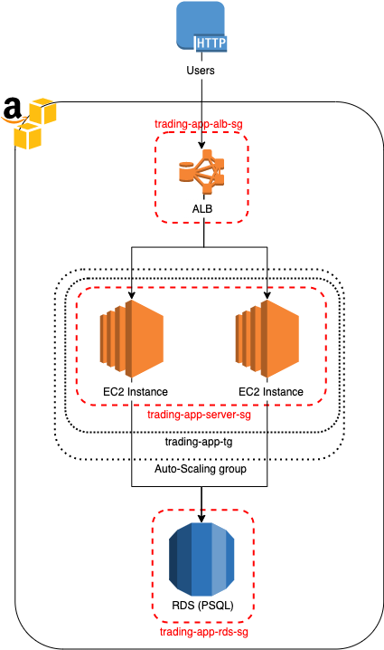
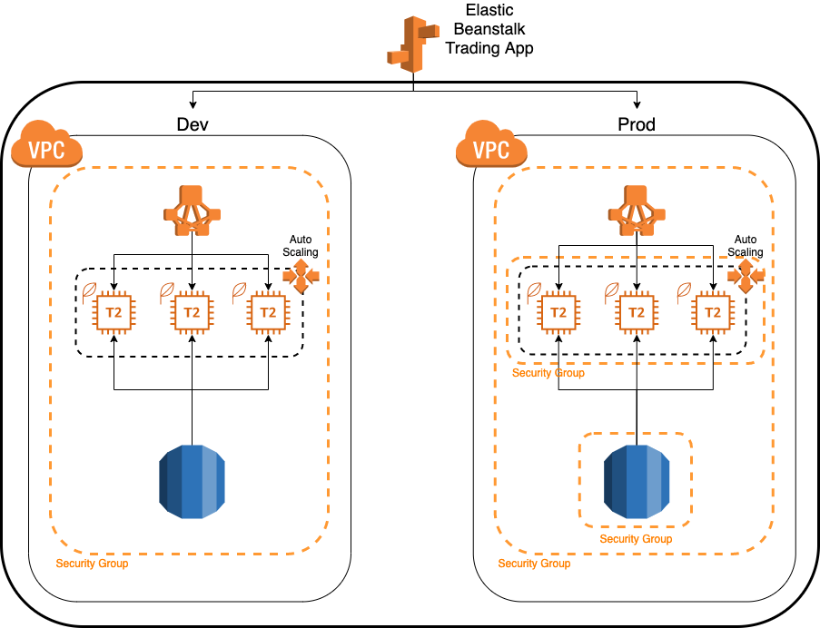
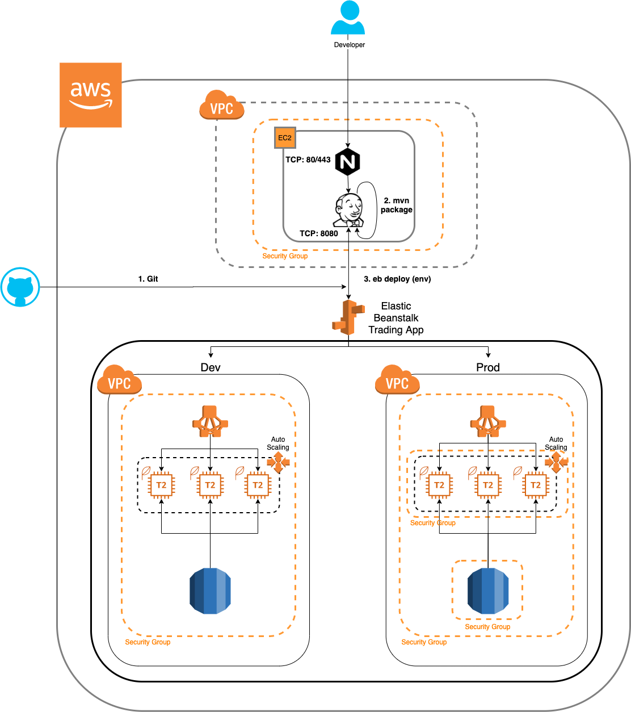

# Cloud & DevOps Project
# Introduction
The goal of this project was to migrate the Springboot trading-app microservice to the AWS cloud as well as create a CI/CD pipeline using 
Jenkins to automate and fasten the deployment lifecycle. The project made use of AWS's Application Load Balancers and Auto Scaling Groups to 
manage scaling and distribution of resources by creating new EC2 instances to host the application as needed. The application also uses a single
RDS database to persist the data. Elastic Beanstalk was used to ease the deployment and scaling of the web app as well as different environments. 
Finally a Jenkins CI/CD pipeline was provisioned to further automate the application by pulling updated version from the Git repository, build 
and deploy them to the corresponding Elastic Beanstalk environment. 

# Application Cloud Architecture

The application Load Balancer acts as a layer between the user and application redirecting the workload to the two different EC2 instances to
ensure that the workload was balanced. The load balancer can also detect which instances have crashed and not forward any requests to these 
unhealthy instances. An Auto Scaling Group is attached to the ALB to make the application scalable and elastic. The ASG automatically creates
and removes EC2 instances to meet the needs of the ALB. 

# Deployment Environments

Live web applications often have multiple environments for different versions of the app to run on. For example it may have a development or 
'dev' environment that holds the version under development and another production or 'prod' environment that holds the complete 
production ready version that is deployed to customers or users. The reason for the two different environments is to avoid pushing buggy dev
code to production by accident. Elastic Beanstalk was used to automate the creation of these environments and provision all the necessary resources. 
# Jenkins Server

# Jenkins CI/CD pipeline
To create the Jenkins pipeline, first a Ubuntu EC2 instance was provisioned, separate from the Elastic Beanstalk environments. Next a NGINX 
reverse proxy was created which automatically forwards HTTP traffic from post 80 to the Jenkins server on port 8080. Next the necessary plugins
were installed and their locations set within the instance. Next the Jenkins file was created which is what defines the CI/CD pipeline. 
The steps of the pipeline can be seen in the diagram above. First Jenkins pulls the updated application version from GitHub and builds a
deployable .jar file. Lastly a bash script is run which executes the Elastic Beanstalk console commands to deploy the .jar file to the correct 
environment.  

# Improvements
1. Tighten security group rules.
2. Make more useful Auto-scaling conditions for the application.
3. Have Jenkins track the develop and master branches instead of feature and develop. 