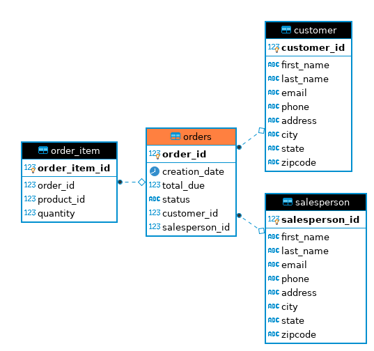

# JDBC 

## Introduction
The aim of this project was to become familiarized with the JDBC library. The JDBC application
creates a connection between a Java application, and a RDBMS using PostgresSQL, and makes 
alterations to the tables using CRUD operations (create, read, update, delete). It focused
on two DAO (Data Access Object) implementations from a sample database, Customers and Orders. 

## ER Diagram

## Design Patterns
DAO's (Data Access Objects) are one of the most common patterns when dealing with databases.
They provide an abstraction layer between the raw JDBC code and the business logic. They are useful
because they allow us to have a single instance of the database and to compute the joins using
the foreign keys, like we did for the Order object.  

In contrast, the repository pattern only focuses on single table accesses per class. So joins
can be performed in the code after all the data has been selected from the different tables. This
is useful when you need to scale your database horizontally, resulting in a more distributed system. 