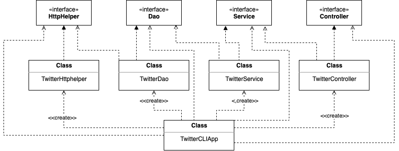

# Twitter CLI App

## Introduction 
The Twitter CLI App is a Java-based application that can post, show, and delete Twitter posts from the command line. It utilizes a MVC 
architecture and the HTTP Client library to access the Twitter REST API. This application required learning of JUnit and Mockito for 
testing and the Spring framework for dependency management. 

## Quick Start
Before you package your application you must set environment variables for Twitter authentication. 
- Twitter Consumer API Key (consumerKey)
- Twitter Consumer API Secret Key (consumerSecret)
- Twitter Access Token (accessToken)
- Twitter Access Token Secret (tokenSecret) 

An example command for setting these variables is as follows:
```shell script
$ export consumerKey='consumer_key_value'
```

Then to package the Twitter CLI Application you can use the maven command: 
```shell script
$ mvn clean package
```

This will create a JAR file that you can use to run your application. The usage of the program is as follows:

```shell script
$ java -jar [.jar file] post "text" "latitude:longitude"
$ java -jar [.jar file] show "id" [fields]
$ java -jar [.jar file] show "id
```

## Design



## Spring
The TwitterCLIApp uses the Spring framework for dependency management, which essentially replaces the main method in the application. There were 
three different approaches to implementing the Spring framework for this application: TwitterCLIBean, TwitterCLIComponentScan, and TwitterCLISpringBoot. 

#### TwitterCLIBean 
A Bean component is a component/class/object that is created/managed by an IoC container, in this application these include TwitterController, 
TwitterService, TwitterDao, and TwitterHttpHelper since they care created by the main method. TwitterCLIBean indicates dependencies by manually 
setting @Bean annotations. 

#### TwitterCLIComponentScan 
An IoC Container, also known as dependency injection (DI) is a process whereby objects define their dependencies only through constructor arguments. 
The container injects those dependencies when it creates the bean. TwitterCLIComponentScan scans the entire Twitter project for all dependencies 
that the application context needs to fulfill.

#### TwitterCLISpringBoot
Spring Boot is an extension of the Spring framework that eliminates the boilerplate configurations required when setting up a Spring application.
TwitterCLISpringBoot configures Spring automatically using this extension. 


## Models

#### Tweet Model 

The main model used in the TwitterCLIApp is the Tweet model, implemented as a POJO. A simplified JSON Tweet object can be seen below. 
```json
{
   "created_at":"Mon Feb 18 21:24:39 +0000 2019",
   "id":1097607853932564480,
   "id_str":"1097607853932564480",
   "text":"test with loc223",
   "entities":{
      "hashtags":[],      
      "user_mentions":[]  
   },
   "coordinates":null,    
   "retweet_count":0,
   "favorite_count":0,
   "favorited":false,
   "retweeted":false
}
```

## Improvements
1. Allow the user to specify more fields when creating a tweet. 
2. Allow the user to create/find multiple tweets like they can for delete. 
3. Allow the user to retrieve a tweet(s) with a parameter other than id. 