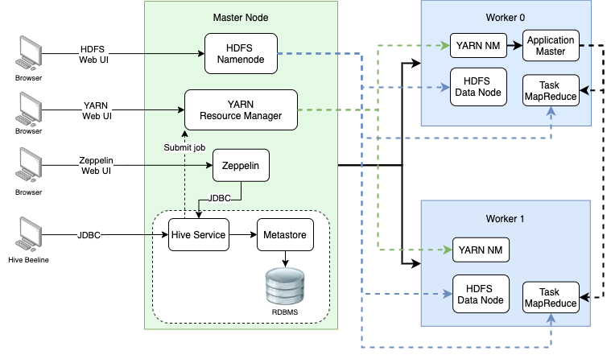

# Hadoop Project 

Table of contents
* [Introduction](#Introduction)
* [Hadoop Cluster](#Hadoop Cluster)
* [Hive Project](#Hive Project)
* [Improvements](#Improvements)

# Introduction
For this project I have helped the data analytics team to process data using Apache Hadoop and evaluate different tools, specifically MapReduce, 
HDFS, and YARN. Hadoop provides a software framework for distributed storage and processing of big data using the MapReduce programming model. 
It utilizes HDFS (Hadoop Distributed File System) which ensures fault tolerance and high availability. For this project I provisioned a 
Hadoop cluster through Google Cloud Computing. Some sample queries uisng Apache Hive were performed on sample data and recorded in a 
Zeppelin notebook. 

# Hadoop Cluster

The Hadoop cluster consists of one master namenode and two worker nodes. Within the master node is the YARN Resource Manager which manages everything in the cluster, 
and communicating with the Node Managers on the worker nodes. The 

# Hive Project
- discuss the purposes of the project and what you have done.
- Post your Zeppelin Notebook screenshot here
	- Make sure your Notebook is nice and clean as hiring managers will visit your project
	- use `Full Page Screen Capture` chrome extention to capture a webpage as a picture

# Improvements
If you have more time, what would you improve?
- at least three improvements