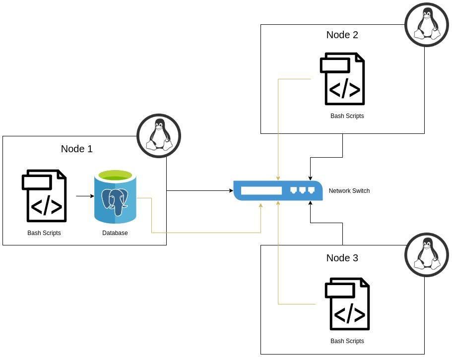

# Linux Cluster Monitoring Agent
## Introduction
The Cluster Monitoring Agent is an internal tool used by the Jarvis Linux Cluster and 
Administration team to gather hardware specifications data of nodes within the linux 
cluster as well as monitor resource usage in real time. The project includes a bash script 
that will initialize a PSQL database within a docker container which will then be used by 
the agent to store the data. The monitoring agent will then use two bash scripts to collect
the relative information about the clusters and populate it inside of this PSQL database. 
The project also include 2 SQL queries that will help the business team answer questions for 
resource planning.    

## Quick Start
```shell script
# Create a psql docker container with the given username and password.
./scripts/psql_docker.sh create db_username db_password

# Execute ddl.sql script on the host_agent database againse the psql instance
psql -h localhost -U postgres -d host_agent -f sql/ddl.sql

# Populate the hardware specifications table in the database by running the host_info script
scripts/host_info.sh psql_host psql_port db_name psql_user psql_password

# Populate the usage statistics table in the databse by running the host_usage script
scripts/host_usage.sh psql_host psql_port db_name psql_user psql_password

# Automate the collection of the usage statistics by running a crontab 
crontab -e 

# Add the line to the open editor to collect the usage data every minute 
* * * * * bash [full/path/to]/linux_sql/scripts/host_usage.sh [psql host] [port] host_agent [db_username] [db_password] &> /tmp/host_usage.log
```
## Architecture Diagram



## Database Modeling
The host_info table holds information on the hardware specifications for the node on which the script was run. The schema is as follows: 

Field | Description 
------|------------
id | Unique Identifier for the host, auto-incremented
hostname | Unique name of the host
cpu_number | The number of cores the CPU has
cpu_architecture | The architecture of the CPU
cpu_model | The name of the CPU model
cpu_mhz | The clock speed of the CPU in MHz
l2_cache | The size of the L2 cache in kB
total_mem | The total size of the memory 
timestamp | The time when the host_info specifications were taken

The host_usage table holds usage statistics for the node on which the script was run. The schema is as follows: 

Field | Description 
------|------------
timestamp | The time when the host_usage statistics were taken 
host_id | The ID of the corresponding host 
memory_free | The amount of free memory available
cpu_idle | The percentage of time that the CPU is idle
cpu_kernel | The percentage of time the CPU is running kernel code
disk_io | The number of disks undergoing I/O processes
disk_available | The Available space in the disk's root directory in MB

## Scripts

The psql_docker.sh script manages the psql docker instance. Usage:
```shell script
# creates a psql docker container with the given username and password.
./scripts/psql_docker.sh create db_username db_pasword

# starts the psql docker container
./scripts/psql_docker.sh start

# stops the running psql docker container
./scripts/psql_docker.sh stop
```

The ddl.sql script creates two tables in the host_agent database, host_info and host_usage. Usage:
```shell script
# docker instance needs to be running
# Execute ddl.sql script on the host_agent database againse the psql instance
psql -h localhost -U postgres -d host_agent -f sql/ddl.sql
```

The host_info.sh script gets the hardware specifications and adds them to the database. Usage:
```shell script
# Get hardware specifications and enter it into the host_info table
 ./scripts/host_info.sh psql_host psql_port db_name psql_user psql_password
```

The host_usage.sh script gets the hardware usage information and adds them to the database. Usage:
```shell script
# Get the usage information and enter it into the host_usage table
 ./scripts/host_usage.sh psql_host psql_port db_name psql_user psql_password
```

crontab allows you to automate the host_usage script to run every minute. Usage:
```shell script
crontab -e
# In the editor which opens, add the line below to collect usage statistics every minute
* * * * * bash [full/path/to]/linux_sql/scripts/host_usage.sh [psql host] [port] host_agent [db_username] [db_password] &> /tmp/host_usage.log
# Can ensure job is running using
crontab -l
```

The queries.sql script contains queries to gather information on the resource usage. The first 
query groups hosts by CPU number and sort by their memory size in descending order. The second 
query get the average used memory in percentage over 5 mins interval for each host. Usage:
```shell script
psql -h localhost -U postgres -d host_agent -f sql/querie.sql
```

## Improvements
* Include more queries that can gather more data for the business analysts on the resource usage
* Complete the node failure query to find out when a node failed to write usage data to DB three 
times in a row.