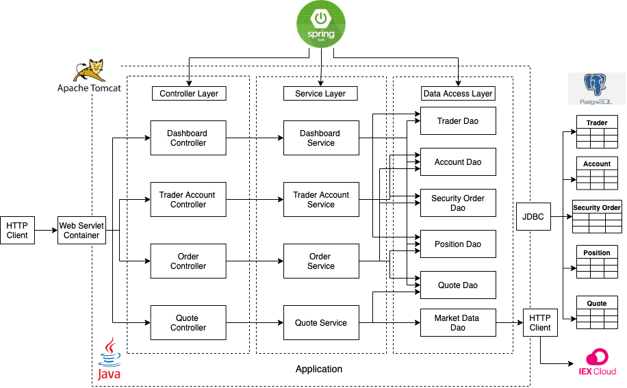

# Springboot Trading Application

Table of contents
* [Introduction](#Introduction)
* [Quick Start](#Quick Start)
* [Architecture](#Architecture)
* [REST API Usage](#REST API Usage)
* [Docker Deployment](#Docker Deployment)
* [Improvements](#Improvements)

## Introduction
The Springboot Trading Application is an online stock trading simulation REST API which can be used by front-end developers, 
mobile developers, and traders. The app supports CRUD operations (create, read, update, delete) on traders, accounts, security orders, 
and quotes. It uses a microservice architecture and Springboot framework as well as a MVC design pattern to manage the code structure. 
The app retrieves real-time and historical market data from the IEX CLoud API and persists the data in a PostgreSQL database. 

## Quick Start
Prequiresites: 
* Docker version 17.05 or higher 
* CentOS 7

Docker:
1. Create a docker network with the following command
```shell script
sudo docker network create trading-net
```

2. Build the Docker images from the provided Dockerfiles
```shell script
cd ./springboot/psql
docker build -t trading-psql . 
```

```shell script
cd ./springboot/
docker build -t trading-app .
```

3. Start the PSQL container and attach it to the network  
```shell script
#start a docker container
#attached the container to the trading-net network
docker run --name trading-psql-dev \
-e POSTGRES_PASSWORD=password \
-e POSTGRES_DB=jrvstrading \
-e POSTGRES_USER=postgres \
--network trading-net \
-d -p 5432:5432 trading-psql
```

4. Start the trading app container and attach it to the network 
```shell script
#set IEX credential
IEX_PUB_TOKEN="your_token"
#start trading-app container which is attached to the trading-net docker network
docker run --name trading-app-dev \
-e "PSQL_URL=jdbc:postgresql://trading-psql-dev:5432/jrvstrading" \
-e "PSQL_USER=postgres" \
-e "PSQL_PASSWORD=password" \
-e "IEX_PUB_TOKEN=${IEX_PUB_TOKEN}" \
--network trading-net \
-p 8080:8080 -t trading-app

```
5. The API should now be accessible from http://localhost:8080

## Architecture


#### Controller Layer 
The controller layer handles the HTTP requests and is responsible for controlling flow of application and its logic. 
It essentially acts as a communicator, getting the data from the API requests, converts it into a more desirable form and then passes it on
to the service layer. 

#### Service Layer 
The service layer handles all the business logic. It receives the data from the controller and performs tasks such as validating the data 
and the called resources. After this is passes the data onto the DAO layer to be processed further.  

#### DAO Layer
The DAO layer interacts directly with the data models, fetching and saving the data in the PSQL database and IEX cloud. 

#### Springboot
Springboot is used to handle the dependency injection for the application. It provides the Tomcat webservlet which handles the API REST requests. 

#### PSQL and IEX
PSQL and IEX handle the actual data that is being fetched and saved throughout the application usage. The stock information is fetched from the 
IEX and it's then stored in the PSQL database in their respective tables.  

## REST API Usage
#### Swagger
Swagger allows you to describe the structure of your APIs so that machines can read them. It reads the API structure and then automatically 
builds interactive API documentation. It was used for this project to generate the UI which is used to test the endpoints of the application.  

#### Quote Controller
The quote controller allows us to fetch quote information from the IEX and store it into the PSQL database as well as update existing quotes 
in the database. 
  - GET `/quote/dailyList`: Lists all securities that are available to trading in this trading system.
  - POST `/tickerId/{tickerId}`: Adds a security with the provided ticker to the daily list and persisting it in the database quote table so 
  that it can be traded later. 
  - GET `/iex/ticker/{ticker}`: Displays all the quote information for the security with the given ticker, the data is pulled from the IEX.
  - PUT `/iexMarketData` : Fetches the updated information from IEX and updates the saved quote information. 
  - POST `/` : Inserts a quote object directly into the quote table in the PSQL database.

#### Trader Controller
the trader controller allows the user to create and delete traders and accounts stored in the PSQL database. It also allows the user to deposit 
or withdraw funds in the trader's account. 
- POST `/firstname/{firstname}/lastname/{lastname}/dob/{dob}/country/{country}/email/{email}` : Creates a trader with given information and saves 
it to the trader table in the database with an account that is tied to the trader. 
- POST `/` : Inserts a trader object directly into the trader table in the PSQL database.
- DELETE `/traderId/{traderId}` : Delete a trader with the given traderId as well as the account that is linked to that trader. The trader's
account must be empty and they must have no open positions. 
- PUT `/deposit/traderId/{traderId}/amount/{amount}` : Deposit the specified amount into the trader's account. Must be a positive number. 
- PUT `/withdraw/traderId/{traderId}/amount/{amount}` : Withdraw the specified amount from the trader's account. Must be a positive number and 
cannot be more money than the trader has in the account. 

#### Order Controller
The order controller handles placing of market orders for the specified securities. 
- POST `/marketOrder` : Takes the marketOrderDto passed to the request and either buys it or sells, if the passed amount is positive it 
indicates a buy order and vice versa for a negative amount). If the ticker or accountId is invalid, or the account balance is insufficient 
then the request will fail. 

#### Dashboard controller
This controller is used to get different views depending on the traderId passed to the request. 
- GET `/profile/traderId/{traderId}` : Shows the profile (trader info and account info) of the trader with the given id. 
- GET `/portfolio/traderId/{traderId}` : Shows the portfolio (list of securities that the trader has a position in) of the trader with the given id. 

## Docker Deployment

Two docker images are used in this application, trading-psql and trading-app. The first of the two is used to run the instance of our psql 
database. A schema.sql script is automatically run when the container is started to initialize the database tables. The second image is based
on the openjdk:8-alpine image in order to run out actual Java application. The jar file is compiled from a separate container that runs Maven
and then copied into the container itself.  

## Improvements
If you have more time, what would you improve?
- at least 5 improvements